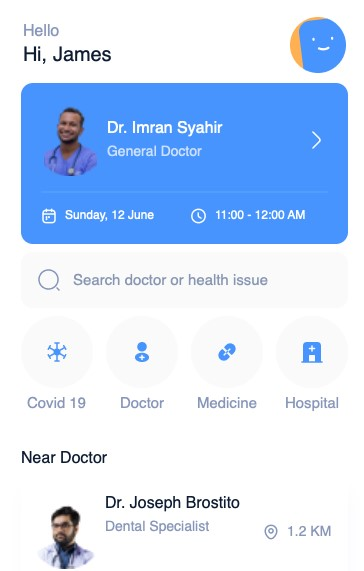
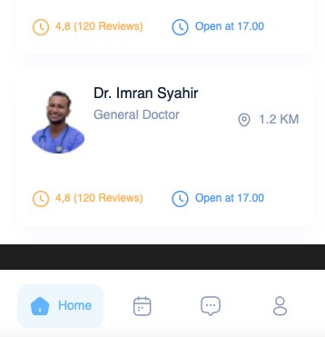

# Разработка мобильных приложений

Студент ОмГУ [ФЦТК] группы МПБ-101, Санников Илья. Реализованный экран на тему запись к врачу:

p.s: Проект почему-то запускался только на my Mac, отказываясь от запуска на других устройствах (8 и 14 версии). Я так и не определил точную ошибку, но понял, что она связана с assets.
     Я пробовал удалять и создавать новый assets, очищал папку с билдами, удалял xCode и делал прочие советы из интернета, но ничего не помогло. Возможно что-то с компиляцией, но не знаю точно.
     Поэтому если проект не запуститься и у вас, то по возможности дайте пожалуйста хотя бы подсказку в каком направлении двигаться чтобы решить ее.

